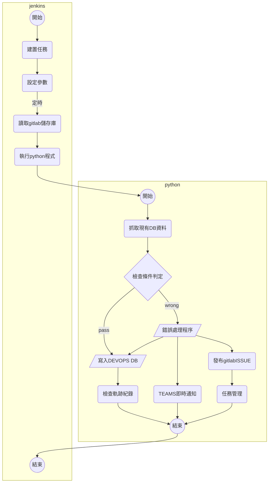

```mermaid
flowchart TD
    subgraph python
        id1((開始)) --> id2(抓取現有DB資料) --> id3{檢查條件判定} --pass-->id4[/寫入DEVOPS DB/] --> id5(檢查軌跡紀錄) --> id6((結束))
        id3 --wrong--> id7[/錯誤處理程序/] 
        id7 --> id8(TEAMS即時通知) --> id6
        id7 --> id9(發布gitlabISSUE) --> id10(任務管理) --> id6
        id7 --> id4
    end

    subgraph jenkins
        id12((開始)) --> id13(建置任務) --> id14(設定參數) --定時--> id17(讀取gitlab儲存庫) --> id15(執行python程式) 
        id16((結束))
    end
    id15 --> id1
    id6 --> id16
```  
  

